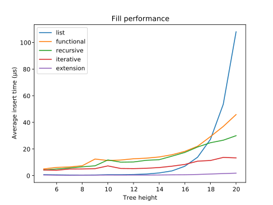
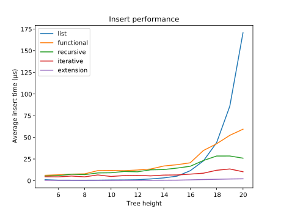
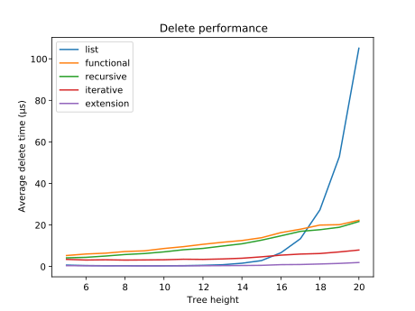

# AVL trees in Python (and C)
An [AVL tree](https://en.wikipedia.org/wiki/AVL_tree) is a self-balancing binary tree. This project explores three pure Python implementations and one Python module in C.

# TL;DR
A pure Python implementation is slower than using the built-in list type and the standard library `bisect` module unless you have a *lot* of elements.

# Functional
The simplest implementation is the [functional](functional.py). It uses the built-in `tuple` type for tree nodes and recursive functions for `insert` and `delete`. Each operation needs to replace all the nodes in the path to the root (even if they have not changed), which is both inefficient and inconvenient.

# Recursive
The [recursive](recursive.py) implementation tries to improve on the functional by using a mode object-oriented style. Nodes are Python objects, which are mutable, and there is an enclosing tree object which tracks the current root.

# Iterative
The [iterative](iterative.py) implementation attempts some basic optimisations. Nodes are of the built-in `list` type, which are mutable and faster to create that Python objects. The `insert` and `delete` functions use iterative algorithms which allow them to short-circuit when a change has no more effect up the tree.

# C Module
The [C module](cavltree.c) uses the same algorithms as the iterative implementation, but implemented in C. The operations use a fixed size stack to avoid memory allocations.

# Performance
To gauge performance, the average time for an operation is measured against the height of the tree in three different tests. The tests are run five times for each height and the results averaged. The elements are all random 64-bit integers which have a low overhead while making collisions highly unlikely.

## Fill
The fill test starts with an empty tree and measures the time to insert 2<sup>n</sup>-1 elements for a tree of height n.



## Insert
The insert test first fills a tree to height n, where the "bottom" layer is half full, then measures the time to insert additional elements until it is 3/4 full.



## Delete
The delete test first fills a tree to height n, where the "bottom" layer is half full, then measures the time to remove elements until it is 1/4 full.



# Conclusion
If you need to an AVL tree from Python, use a C module.

# Requirements
The code has been tested on Ubuntu 18.04 (Python 3.6.9) and Ubuntu 20.04 on WSL2 on Windows 10 (Python 3.8.2).

Building the C module reqires Python headers:
```
sudo apt install python3-dev
```
Generating the graphs requires matplotlib:
```
sudo apt install python3-matplotlib python3-cairo
```
